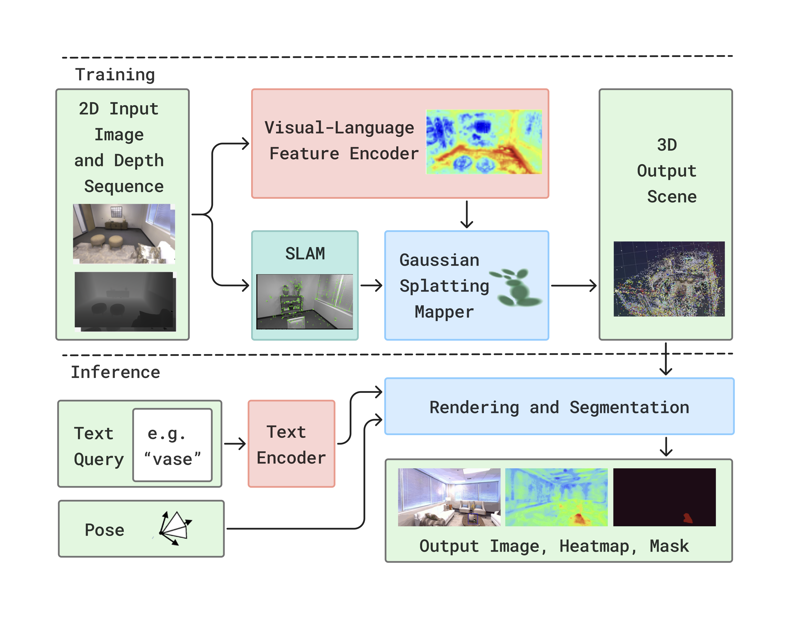

# LEG-SLAM: Real-Time Language-Enhanced Gaussian Splatting for SLAM

## Overview

LEG-SLAM is an **open-vocabulary** 3D SLAM system integrating **3D Gaussian Splatting** with **DINOv2 feature extraction**, allowing **real-time** semantic scene understanding.

🔹 **10 FPS on Replica, 18 FPS on ScanNet**  
🔹 **Real-time 3D Reconstruction with Gaussian Splatting**  
🔹 **Text-based Semantic Queries using Talk2DINO**  
🔹 **Efficient Feature Compression via PCA**

## 📜 Paper
Under Review at ICCV 2025. Stay tuned for updates!

## 🚀 Code Release
Code will be released after paper acceptance.

### Links
- [GitHub Repository](https://github.com/Titrom025/LEG-SLAM/)
- [Project Page](https://titrom025.github.io/LEG-SLAM/)